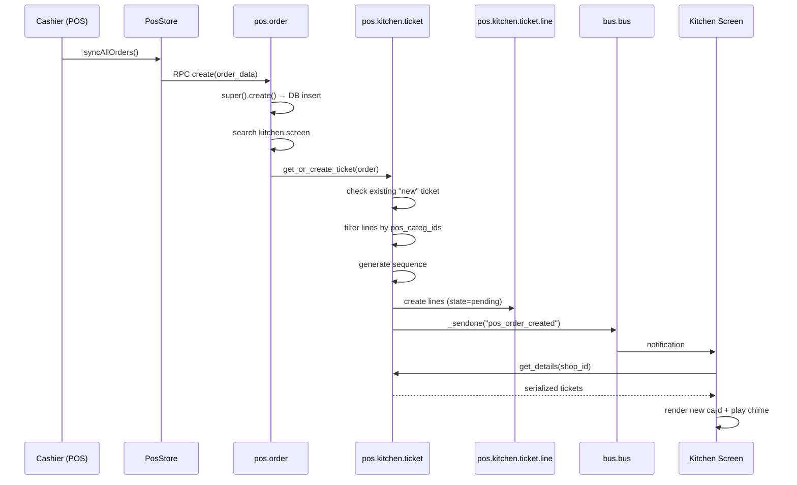
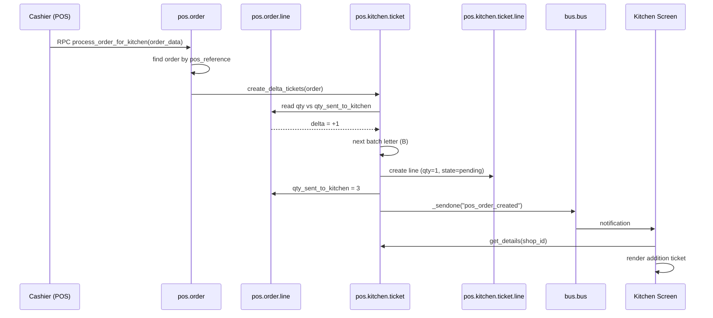
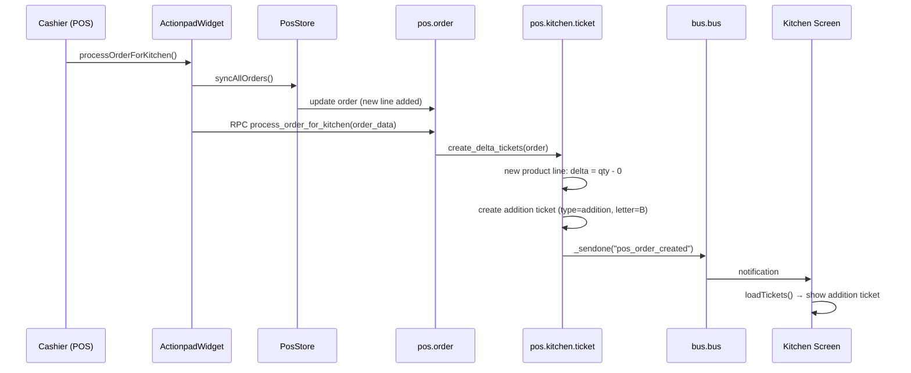
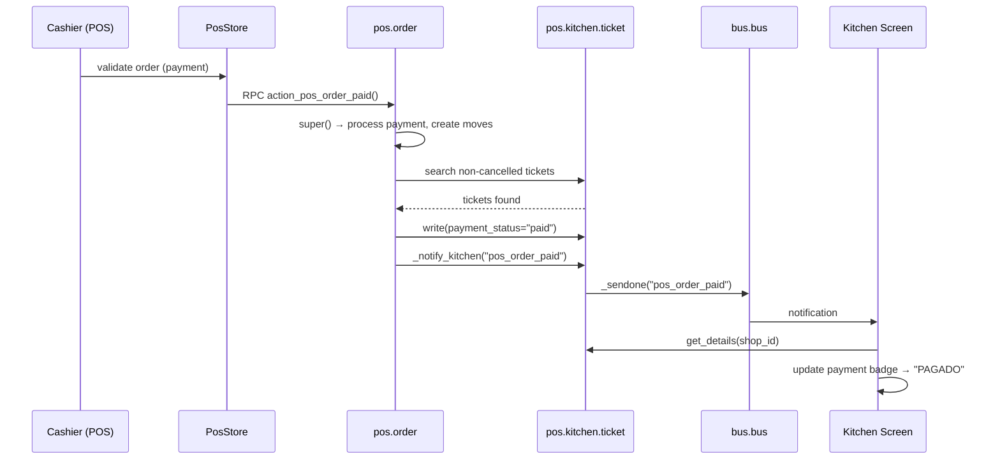
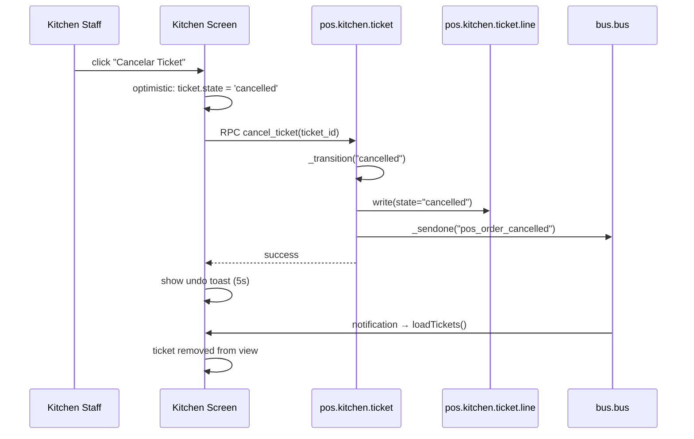
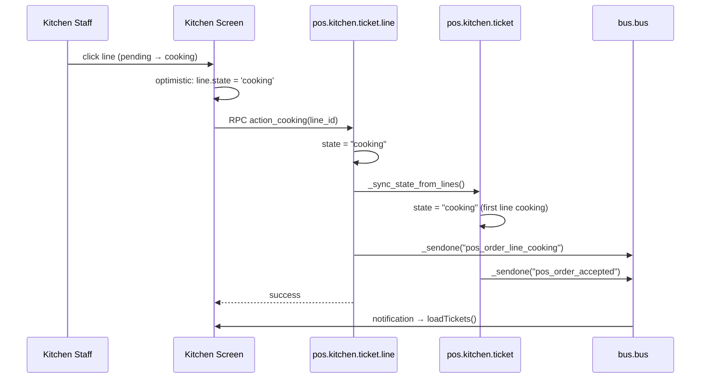
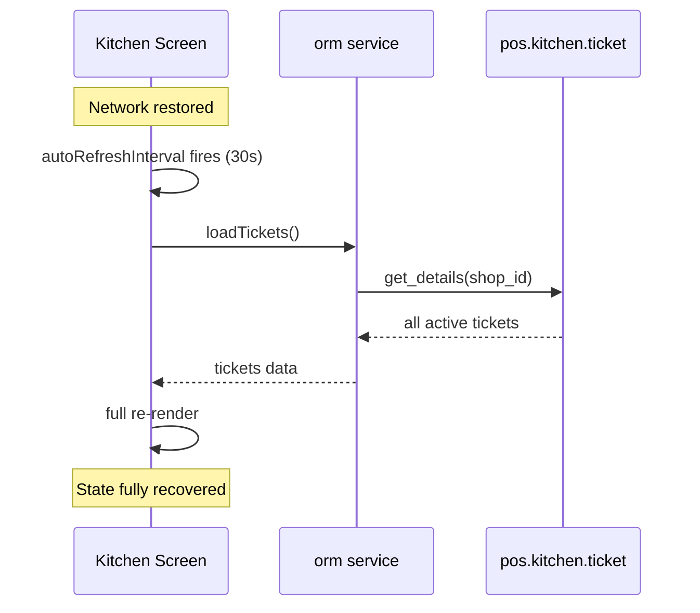

# KDS Workflow Analysis — `pos_kitchen_screen_odoo`
> **Module:** POS Kitchen Screen (Cybrosys, v19.0.1.0)
> **License:** LGPL-3
> **Dependencies:** `web`, `pos_restaurant`
> **External dependency:** `pos_kitchen_receipt` (provides `kitchen.ticket.printer` model)
---
## 1. Architecture Overview
### Purpose
This module adds a **Kitchen Display System (KDS)** to Odoo 19 POS. When a cashier sends an order from the POS, the module creates a **Kitchen Ticket** that appears in real-time on a kitchen screen (tablet/TV). Kitchen staff can track preparation progress per line item, advance states, cancel items, and print physical tickets via CUPS.
### Main Responsibilities
1. **Order type classification** — Mesa / Delivery / Retira
2. **Kitchen ticket creation** — Automatic on `pos.order` creation
3. **Delta tracking** — Detects quantity changes and creates addition/cancellation tickets
4. **Real-time synchronization** — Bus notifications push changes to the KDS
5. **State machine management** — Ticket and line-level state transitions with validation
6. **Kitchen dashboard UI** — OWL component with station filtering, oven queue, SLA timers, undo support
7. **Ticket printing** — Delegates to `kitchen.ticket.printer` (external module)
### Integration Points with Odoo POS
| Integration | Mechanism |
|---|---|
| POS order creation | `pos.order.create()` override |
| POS payment | `pos.order.action_pos_order_paid()` override |
| POS order lines | `pos.order.line` inherits with `qty_sent_to_kitchen` field |
| POS frontend model | `PosOrder.prototype` patched for `order_type` |
| POS control buttons | `ControlButtons.prototype` patched for order type buttons |
| POS action pad | `ActionpadWidget.prototype` patched for `processOrderForKitchen()` |
| POS store | `PosStore.prototype` patched for `pos_orders` / `pos_order_lines` getters |
| POS store validation | `PosStore._finalizeValidation()` patched (no-op passthrough) |
### Frontend Components
| Component | File | Purpose |
|---|---|---|
| `KitchenScreenDashboard` | `kitchen_screen.js` | OWL component; the full KDS UI |
| `ActionpadWidget` patch | `order_button.js` | Adds `processOrderForKitchen()` to POS |
| `ControlButtons` patch | `order_type_buttons.js` | Adds Mesa/Delivery/Retira buttons |
| `PosOrder` patch | `order_model.js` | Default `order_type` on order setup |
| `PosStore` patch | `fields_load.js` | Convenience getters for orders/lines |
| `PosStore` patch | `order_pay.js` | Passthrough on `_finalizeValidation` |
### Backend Models
| Model | Type | Purpose |
|---|---|---|
| `kitchen.screen` | New | Configuration: which POS + categories route to kitchen |
| `pos.kitchen.ticket` | New | Kitchen ticket (header) with state machine |
| `pos.kitchen.ticket.line` | New | Kitchen ticket line item with per-item state |
| `pos.order` | Inherited | Adds `order_type`, `requested_time`, auto-creates tickets |
| `pos.order.line` | Inherited | Adds `qty_sent_to_kitchen` for delta tracking |
| `pos.session` | Inherited | Stub (no overrides needed in Odoo 19) |
| `product.product` | Inherited | Adds `prepair_time_minutes` |
### Real-Time Communication
- **Bus channels:** `pos_kitchen.{pos_config_id}` — one channel per POS terminal
- **Transport:** Odoo's `bus.bus` longpolling mechanism
- **Events:** 11 distinct notification types (see Section 5)
- **Polling fallback:** 30-second `setInterval` auto-refresh on the KDS
### Architecture Diagram
```
┌─────────────────────────────────────────────────────────┐
│                    POS TABLET (Cashier)                  │
│                                                         │
│  ┌──────────┐  ┌──────────────┐  ┌──────────────────┐  │
│  │ Order UI │→ │ PosOrder Model│→ │ ActionpadWidget  │  │
│  │          │  │ (order_type, │  │ .processOrderFor │  │
│  │          │  │  lines, qty) │  │  Kitchen()       │  │
│  └──────────┘  └──────┬───────┘  └────────┬─────────┘  │
│                       │                    │            │
└───────────────────────┼────────────────────┼────────────┘
                        │                    │
                   RPC create           RPC process_order
                   pos.order            _for_kitchen
                        │                    │
┌───────────────────────┼────────────────────┼────────────┐
│                 ODOO SERVER                             │
│                       │                    │            │
│  ┌────────────────────▼────────────────────▼─────────┐  │
│  │              pos.order (inherited)                 │  │
│  │  .create() → get_or_create_ticket()               │  │
│  │  .action_pos_order_paid() → update payment_status │  │
│  │  .process_order_for_kitchen() → create_delta_     │  │
│  │                                    tickets()       │  │
│  └────────────────────┬──────────────────────────────┘  │
│                       │                                  │
│  ┌────────────────────▼──────────────────────────────┐  │
│  │          pos.kitchen.ticket                        │  │
│  │  get_or_create_ticket() → creates ticket + lines  │  │
│  │  create_delta_tickets() → addition/cancellation   │  │
│  │  progress_to_cooking/ready/delivered()            │  │
│  │  cancel_ticket()                                  │  │
│  │  _notify_kitchen() → bus.bus._sendone()           │  │
│  │  get_details() → serialized ticket data for KDS   │  │
│  └────────────────────┬──────────────────────────────┘  │
│                       │                                  │
│  ┌────────────────────▼──────────────────────────────┐  │
│  │          pos.kitchen.ticket.line                   │  │
│  │  action_cooking/ready/cancel/toggle()             │  │
│  │  _sync_state_from_lines() → propagates to ticket  │  │
│  └────────────────────┬──────────────────────────────┘  │
│                       │                                  │
│  ┌────────────────────▼──────────────────────────────┐  │
│  │              bus.bus                                │  │
│  │  Channel: pos_kitchen.{config_id}                  │  │
│  │  Events: pos_order_created, pos_order_paid,       │  │
│  │          pos_order_accepted, pos_order_completed,  │  │
│  │          pos_order_delivered, pos_order_cancelled, │  │
│  │          pos_order_line_cooking/ready/cancelled,   │  │
│  │          pos_order_line_updated, pos_order_updated │  │
│  └────────────────────┬──────────────────────────────┘  │
│                       │                                  │
└───────────────────────┼──────────────────────────────────┘
                        │
              Bus Longpolling / WebSocket
                        │
┌───────────────────────┼──────────────────────────────────┐
│              KITCHEN SCREEN (Tablet/TV)                   │
│                       │                                  │
│  ┌────────────────────▼──────────────────────────────┐  │
│  │      KitchenScreenDashboard (OWL Component)        │  │
│  │                                                    │  │
│  │  onTicketNotification() → loadTickets()            │  │
│  │  onCardClick() → _advanceTicket()                  │  │
│  │  onLineClick() → action_cooking/ready/cancel       │  │
│  │  cancelTicket() → cancel_ticket RPC                │  │
│  │  printTicket() → print_ticket RPC                  │  │
│  │  _showUndoToast() → undo support                   │  │
│  │  _playChime() → audio alert                        │  │
│  │  Auto-refresh every 30s                            │  │
│  └───────────────────────────────────────────────────┘  │
│                                                         │
└─────────────────────────────────────────────────────────┘
```
---
## 2. Module Structure
| File | Type | Purpose | Dependencies | Used By |
|---|---|---|---|---|
| `__manifest__.py` | Manifest | Module metadata, asset declarations, dependencies | — | Odoo loader |
| `__init__.py` | Init | Imports `models` package | — | Odoo loader |
| `models/__init__.py` | Init | Imports all 6 model files | — | `__init__.py` |
| `models/kitchen_screen.py` | Model | `kitchen.screen` — configuration model | `odoo` | `pos_kitchen_ticket.py`, views |
| `models/pos_kitchen_ticket.py` | Model | `pos.kitchen.ticket` + `pos.kitchen.ticket.line` — core ticket logic | `odoo`, `json`, `pos_kitchen_receipt` (runtime) | `pos_orders.py`, `kitchen_screen.js`, tests |
| `models/pos_orders.py` | Model | `pos.order` inherit — auto-creates tickets, payment hook, delta processing | `odoo` | POS frontend via RPC |
| `models/pos_order_line.py` | Model | `pos.order.line` inherit — adds `qty_sent_to_kitchen` field | `odoo` | `pos_kitchen_ticket.py` (delta logic) |
| `models/pos_session.py` | Model | `pos.session` inherit — stub, no active overrides | `odoo` | — (placeholder) |
| `models/product_product.py` | Model | `product.product` inherit — adds `prepair_time_minutes` | `odoo`, `re` | Product form view |
| `tests/__init__.py` | Init | Imports test module | — | Odoo test runner |
| `tests/test_kitchen_ticket.py` | Test | 16 test cases covering ticket lifecycle, deltas, payment, categories | `odoo.tests` | — |
| `static/src/js/fields_load.js` | JS | Patches `PosStore` with `pos_orders` / `pos_order_lines` getters | `@web/core/utils/patch`, `PosStore` | `order_button.js` |
| `static/src/js/kitchen_screen.js` | JS | `KitchenScreenDashboard` OWL component — full KDS UI | `owl`, `@web/core/registry`, `bus_service`, `orm`, `notification` | Registered as `kitchen_custom_dashboard_tags` action |
| `static/src/js/order_button.js` | JS | Patches `ActionpadWidget` with `processOrderForKitchen()` | `@web/core/utils/patch`, `ActionpadWidget` | POS UI |
| `static/src/js/order_model.js` | JS | Patches `PosOrder` to set default `order_type` | `@web/core/utils/patch`, `PosOrder` | POS model layer |
| `static/src/js/order_pay.js` | JS | Patches `PosStore._finalizeValidation()` (passthrough) | `@web/core/utils/patch`, `PosStore` | POS payment flow |
| `static/src/js/order_type_buttons.js` | JS | Patches `ControlButtons` with order type getters/setters | `@web/core/utils/patch`, `ControlButtons` | `order_type_buttons.xml` |
| `static/src/xml/kitchen_screen_templates.xml` | OWL Template | `KitchenCustomDashBoard` — full KDS dashboard template | `kitchen_screen.js` | `KitchenScreenDashboard` |
| `static/src/xml/order_type_buttons.xml` | OWL Template | Extends `ControlButtons` with Mesa/Delivery/Retira buttons | `order_type_buttons.js` | POS UI |
| `static/src/css/kitchen_screen.css` | CSS | Complete KDS styling — dark theme, cards, animations, responsive grid | — | `kitchen_screen_templates.xml` |
| `security/pos_kitchen_screen_groups.xml` | Security | Defines `Kitchen Cook` group + module category | — | `ir.model.access.csv` |
| `security/ir.model.access.csv` | Security | ACL rules for `kitchen.screen`, `pos.kitchen.ticket`, `pos.kitchen.ticket.line` | Groups XML | Odoo security |
| `data/kitchen_screen_data.xml` | Data | `ir.sequence` records for `kitchen.screen` and `kitchen.ticket` | — | Models (sequence generation) |
| `views/kitchen_screen_views.xml` | View | Form/tree views + client action for KDS dashboard | `kitchen_screen.py` | Menu |
| `views/pos_kitchen_screen_odoo_menus.xml` | View | Menu items under Point of Sale root | — | Odoo menu system |
| `views/pos_order_views.xml` | View | Inherits `pos.order` form/tree to show `order_type` + `requested_time` | `pos_orders.py` | Backend views |
| `views/product_product_views.xml` | View | Inherits product form to show `prepair_time_minutes` | `product_product.py` | Backend views |
---
## 3. Data Models
### 3.1 `kitchen.screen` (New Model)
Configuration model that maps a POS terminal to kitchen categories.
| Field | Type | Attributes | Purpose |
|---|---|---|---|
| `sequence` | Char | `readonly=True, default='New', copy=False` | Auto-generated sequence |
| `pos_config_id` | Many2one → `pos.config` | Domain: restaurant mode, not already assigned | Which POS terminal this screen serves |
| `pos_categ_ids` | Many2many → `pos.category` | — | Which product categories route to this kitchen |
| `shop_number` | Integer | `related='pos_config_id.id'` | Convenience accessor |
| `is_preparation_complete` | Boolean | `default=False` | Auto-advance stage on prep time completion |
| `printer_name` | Char | `default='XP-80'` | CUPS printer name for ticket printing |
| `oven_capacity` | Integer | `default=6` | Max pizzas in oven simultaneously |
**Methods:**
- `create()` — Generates sequence via `ir.sequence` code `kitchen.screen`
- `kitchen_screen()` — Returns `ir.actions.act_url` redirecting to `/pos/kitchen?pos_config_id=X`
- `_pos_shop_id()` — Domain filter preventing duplicate POS assignments
### 3.2 `pos.kitchen.ticket` (New Model)
The core kitchen ticket representing a batch of items to prepare.
| Field | Type | Attributes | Purpose |
|---|---|---|---|
| `origin_pos_order_id` | Many2one → `pos.order` | `required=True, ondelete='restrict', index=True` | Link to source POS order |
| `pos_config_id` | Many2one → `pos.config` | `related='origin_pos_order_id.config_id', store=True` | POS terminal |
| `pos_reference` | Char | `related='origin_pos_order_id.pos_reference', store=True` | POS order reference |
| `order_name` | Char | `related='origin_pos_order_id.name', store=True` | Order name |
| `table_id` | Many2one → `restaurant.table` | `related='origin_pos_order_id.table_id', store=True` | Table |
| `partner_id` | Many2one → `res.partner` | `related='origin_pos_order_id.partner_id', store=True` | Customer |
| `session_id` | Many2one → `pos.session` | `related='origin_pos_order_id.session_id', store=True` | Session |
| `sequence` | Char | `readonly=True, default='Nuevo', copy=False` | Auto-generated (KT-0001) |
| `batch_letter` | Char | `default='A', size=1` | A=original, B/C/D=additions/cancellations |
| `ticket_type` | Selection | `new/addition/cancellation/modification`, `default='new'` | Ticket classification |
| `state` | Selection | `pending/cooking/waiting/ready/delivered/cancelled`, `default='pending'` | Ticket state |
| `payment_status` | Selection | `paid/not_paid`, `default='not_paid'` | Snapshot at creation time |
| `line_ids` | One2many → `pos.kitchen.ticket.line` | `ticket_id` | Ticket line items |
| `started_at` | Datetime | — | When cooking started |
| `ready_at` | Datetime | — | When marked ready |
| `delivered_at` | Datetime | — | When delivered |
| `requested_time` | Datetime | — | Customer-requested delivery time |
| `order_type` | Selection | `mesa/delivery/retira` | Order type (copied from pos.order) |
**State Transition Map (Ticket):**
```
VALID_TRANSITIONS = {
    "pending":    {"cooking", "cancelled"},
    "cooking":    {"ready", "cancelled"},
    "waiting":    {"cooking", "cancelled"},
    "ready":      {"delivered", "cancelled"},
    "delivered":  {},           # terminal
    "cancelled":  {},           # terminal
}
```
**Key Methods:**
- `get_or_create_ticket(pos_order)` — Creates initial "new" ticket; idempotent (returns existing)
- `create_delta_tickets(pos_order)` — Compares `qty` vs `qty_sent_to_kitchen`; creates addition/cancellation tickets
- `get_details(shop_id)` — Serializes all active tickets for KDS consumption
- `progress_to_cooking/ready/delivered()` — State advancement with bus notification
- `cancel_ticket()` — Terminal cancellation
- `_sync_state_from_lines()` — Auto-advances ticket state based on line states
- `_notify_kitchen(message_type)` — Sends bus notification on channel `pos_kitchen.{config_id}`
- `action_line_cooking/ready/cancel(line_id)` — Line-level state changes via ticket
- `print_ticket()` — Delegates to `kitchen.ticket.printer` (external module)
- `_get_oven_capacity()`, `_count_oven_items()`, `_own_oven_items()` — Oven queue management
### 3.3 `pos.kitchen.ticket.line` (New Model)
Individual line item within a kitchen ticket.
| Field | Type | Attributes | Purpose |
|---|---|---|---|
| `ticket_id` | Many2one → `pos.kitchen.ticket` | `required=True, ondelete='cascade'` | Parent ticket |
| `pos_order_line_id` | Many2one → `pos.order.line` | `required=True, ondelete='cascade'` | Source POS order line |
| `product_id` | Many2one → `product.product` | `related='pos_order_line_id.product_id', store=True` | Product |
| `full_product_name` | Char | `related='pos_order_line_id.full_product_name', store=True` | Full display name |
| `note` | Char | — | Extracted text from POS note (JSON → string) |
| `product_category` | Char | — | Category for station routing (Pizza, Empanada, Bebida, Otro) |
| `qty_total` | Float | `default=1.0` | Total quantity on this ticket line |
| `qty_sent` | Float | `default=1.0` | Quantity sent to kitchen |
| `qty_ready` | Float | `default=0.0` | Quantity marked ready |
| `qty_cancelled` | Float | `default=0.0` | Quantity cancelled |
| `state` | Selection | `pending/cooking/waiting/ready/cancelled`, `default='pending'` | Line state |
**State Transition Map (Line):**
```
LINE_TRANSITIONS = {
    "pending":    {"cooking"},
    "cooking":    {"ready", "cancelled"},
    "waiting":    {"cooking", "cancelled"},
    "ready":      {"cancelled"},
    "cancelled":  {},
}
```
**Toggle Cycle (for quick UI cycling):**
```
pending → cooking → ready → cancelled → pending
```
**Key Methods:**
- `action_cooking()` / `action_ready()` / `action_cancel()` — Individual state transitions with bus notification
- `action_toggle()` — Cycles through states (used for quick tap interaction)
### 3.4 `pos.order` (Inherited)
| Field | Type | Attributes | Purpose |
|---|---|---|---|
| `order_type` | Selection | `mesa/delivery/retira`, `default='mesa'` | Order type classification |
| `requested_time` | Datetime | — | Customer-requested time |
**Overrides:**
- `create()` — After super, searches for `kitchen.screen` matching `config_id` and calls `get_or_create_ticket()`
- `action_pos_order_paid()` — After super, updates all non-cancelled tickets' `payment_status` to `"paid"` and notifies kitchen; if no tickets exist, creates one
- `process_order_for_kitchen(order_data)` — RPC endpoint; finds order by `pos_reference` + `config_id`, calls `create_delta_tickets()`
### 3.5 `pos.order.line` (Inherited)
| Field | Type | Attributes | Purpose |
|---|---|---|---|
| `qty_sent_to_kitchen` | Float | `default=0.0` | Tracks quantity already sent; used for delta detection |
**Overrides:**
- `_load_pos_data_fields(config_id)` — Appends `qty_sent_to_kitchen` to fields loaded by POS
### 3.6 `product.product` (Inherited)
| Field | Type | Attributes | Purpose |
|---|---|---|---|
| `prepair_time_minutes` | Float | `digits=(12,2)` | Preparation time (stored as decimal minutes) |
**Overrides:**
- `_onchange_prepair_time()` — Converts `MM:SS` string input to decimal
### 3.7 `pos.session` (Inherited — Stub)
No active overrides. Comment-only file noting session-level integration is handled by `pos.order.line._load_pos_data_fields`.
### Relationship Diagram
```
pos.config ─────────────────────────────────┐
    │                                       │
    │ 1:N                                   │ 1:1
    ▼                                       ▼
pos.order ──────────────────────► kitchen.screen
    │                                   │
    │ 1:N                               │ Many2many
    ▼                                   ▼
pos.order.line ◄────────────── pos.category
    │  ▲                           ▲
    │  │ 1:N                       │ Many2many
    │  │                           │
    │  ▼                           │
    │ pos.kitchen.ticket           │
    │     │                        │
    │     │ 1:N                    │
    │     ▼                        │
    │ pos.kitchen.ticket.line ─────┘
    │     │ (pos_order_line_id → Many2one → pos.order.line)
    │     │ (product_id → related → pos.order.line.product_id)
    │
    │ N:1
    ▼
pos.session
```
**Cascade Behavior:**
- `pos.kitchen.ticket.origin_pos_order_id` → `ondelete='restrict'` (cannot delete order with tickets)
- `pos.kitchen.ticket.line.ticket_id` → `ondelete='cascade'` (deleting ticket deletes lines)
- `pos.kitchen.ticket.line.pos_order_line_id` → `ondelete='cascade'` (deleting order line deletes kitchen line)
---
## 4. Order Lifecycle
### 4.1 Order Creation
```
1. Cashier adds products in POS UI
   → PosOrder model creates lines in-memory (temporary IDs)
2. Cashier clicks "Order" button
   → ActionpadWidget.processOrderForKitchen() is available
   → pos.syncAllOrders() serializes order to backend via RPC
3. Backend: pos.order.create() executes
   → super().create() persists order + lines to DB
   → Override searches for kitchen.screen matching config_id
   → If kitchen.screen exists:
     → KitchenTicket.get_or_create_ticket(order) is called
4. get_or_create_ticket(order):
   a. Checks for existing "new" ticket (idempotency guard)
   b. Finds kitchen.screen for this pos.config
   c. Iterates order.lines, checks if product's pos_categ_ids
      intersect with kitchen_screen.pos_categ_ids
   d. If no kitchen items → returns False (no ticket)
   e. Generates sequence (KT-0001)
   f. Creates pos.kitchen.ticket:
      - origin_pos_order_id = order.id
      - ticket_type = "new"
      - batch_letter = "A"
      - payment_status = "paid" if order.state=="paid" else "not_paid"
      - order_type = order.order_type
      - requested_time = order.requested_time
   g. Creates pos.kitchen.ticket.line for each kitchen item:
      - qty_total = order_line.qty
      - qty_sent = order_line.qty
      - note = _extract_note_text(order_line.note)
      - state = "pending"
      - product_category = _get_product_category(product)
   h. Sends bus notification: "pos_order_created"
5. Kitchen Screen receives bus notification:
   → onTicketNotification() matches config_id
   → loadTickets() calls get_details(shop_id)
   → UI re-renders with new ticket card
   → Audio chime plays + vibration
```
**Methods Executed:**
1. `PosOrder.setup()` — Sets default `order_type`
2. `pos.order.create()` — DB insert + ticket creation
3. `pos.kitchen.ticket.get_or_create_ticket()` — Ticket + lines creation
4. `pos.kitchen.ticket._notify_kitchen("pos_order_created")` — Bus event
**Models Modified:**
- `pos.order` (INSERT)
- `pos.order.line` (INSERT)
- `pos.kitchen.ticket` (INSERT)
- `pos.kitchen.ticket.line` (INSERT)
**Bus Events:**
- Channel: `pos_kitchen.{config_id}`
- Payload: `{res_model: "pos.kitchen.ticket", message: "pos_order_created", ticket_id, config_id}`
### 4.2 Order Modification
#### Quantity Increases (e.g., 2 → 3)
```
1. Cashier modifies qty in POS
2. processOrderForKitchen() called
   → syncAllOrders() persists updated qty
   → RPC: pos.order.process_order_for_kitchen(order_data)
3. process_order_for_kitchen():
   → Finds pos.order by pos_reference + config_id
   → Calls create_delta_tickets(pos_order)
4. create_delta_tickets():
   → For each order_line with kitchen categories:
     → delta = order_line.qty - order_line.qty_sent_to_kitchen
     → delta = 3 - 2 = 1 (positive → addition)
     → Creates new ticket:
       - ticket_type = "addition"
       - batch_letter = next available (B, C, D...)
       - line: qty_total = 1, state = "pending"
     → Updates order_line.qty_sent_to_kitchen = 3
     → Sends bus: "pos_order_created"
```
#### Quantity Decreases (e.g., 3 → 1)
```
1-3. Same as above, but:
   → delta = 1 - 3 = -2 (negative → cancellation)
   → Creates new ticket:
     - ticket_type = "cancellation"
     - batch_letter = next available
     - line: qty_total = 2, state = "cancelled"
   → Updates qty_sent_to_kitchen = 1
   → Sends bus: "pos_order_created"
```
#### Product Removed
Same as quantity decrease to 0. The entire line's previously-sent quantity becomes a cancellation ticket.
#### Note Added
Notes are captured at ticket creation time via `_extract_note_text()`. If a note is added after the initial ticket, it will appear on the next delta ticket (addition/cancellation) but NOT on the existing ticket. This is a **known limitation** — existing tickets are not retroactively updated with new notes.
#### Product Added After Initial Submission
Creates an addition delta ticket (same as quantity increase). The new product line appears as a separate ticket with `ticket_type="addition"` and `batch_letter` incremented.
#### Order Partially Prepared
Kitchen staff clicks individual lines to advance them:
- Line state transitions: `pending → cooking → ready`
- Ticket state auto-syncs via `_sync_state_from_lines()`
- When all lines are `ready` (or `cancelled`), ticket auto-advances to `ready`
#### Order Resent to Kitchen
`processOrderForKitchen()` is idempotent for the initial send (via `get_or_create_ticket` checking for existing "new" ticket). Subsequent sends go through `create_delta_tickets()` which only creates tickets for changed quantities.
#### Duplicate Kitchen Tickets Avoided
1. `get_or_create_ticket()` searches for existing `ticket_type="new"` before creating
2. `create_delta_tickets()` compares `qty` vs `qty_sent_to_kitchen` — only creates tickets when delta ≠ 0
3. After creating delta tickets, `qty_sent_to_kitchen` is updated to prevent re-creating
### 4.3 Payment Flow
#### Payment Screen Opens
No kitchen interaction. Payment is a POS-only concern until validation.
#### Order Paid in Full
```
1. Cashier completes payment
2. PosStore._finalizeValidation() executes
   → Patched method calls super (passthrough)
3. Backend: pos.order.action_pos_order_paid()
   → super() processes payment (creates account moves, updates session)
   → Override searches for non-cancelled tickets for this order
   → If tickets exist:
     → ticket.payment_status = "paid" (batch write)
     → For each ticket: _notify_kitchen("pos_order_paid")
   → If no tickets exist:
     → get_or_create_ticket(order) — creates ticket if kitchen items present
```
**State Transitions:**
- `pos.order.state`: `draft → paid` (handled by Odoo core)
- `pos.kitchen.ticket.payment_status`: `not_paid → paid`
- Kitchen ticket `state` is NOT affected by payment — preparation continues independently
**Accounting Entries:** Created by Odoo core `action_pos_order_paid()` — not modified by this module.
#### Kitchen Synchronization During Payment
The KDS receives `pos_order_paid` notification. The kitchen screen UI updates the payment badge from "FALTA PAGAR" to "PAGADO" on the next `loadTickets()` call.
**Important:** Payment does NOT cancel or pause kitchen preparation. The kitchen continues working on the order regardless of payment status. This is intentional for a restaurant workflow.
#### Payment Cancelled / Modified
If payment is reversed (order goes back to draft), the module does NOT revert `payment_status` on kitchen tickets. This is a **potential data inconsistency** — the ticket will show "PAGADO" even though payment was reversed.
#### Customer Changes Products After Payment
If the cashier modifies products after payment, `process_order_for_kitchen()` creates delta tickets. These delta tickets will have `payment_status="paid"` (since `pos_order.state == "paid"` at that point).
### 4.4 Cancellation Flow
#### Entire Order Cancelled (from KDS)
```
1. Kitchen staff clicks "Cancelar Ticket" button
2. cancelTicket() in kitchen_screen.js:
   → Optimistic UI: ticket.state = 'cancelled'
   → RPC: pos.kitchen.ticket.cancel_ticket(ticket_id)
3. Backend cancel_ticket():
   → _transition("cancelled") — validates state allows it
   → line_ids.write({"state": "cancelled"}) — cancels all lines
   → _notify_kitchen("pos_order_cancelled")
4. Bus notification triggers loadTickets() on all KDS clients
5. Ticket disappears (get_details filters out cancelled/delivered)
```
#### Single Order Line Cancelled (from KDS)
```
1. Kitchen staff clicks "X" button on a line
2. cancelLine() in kitchen_screen.js:
   → Optimistic UI: line.state = 'cancelled'
   → RPC: pos.kitchen.ticket.line.action_cancel(line_id)
3. Backend action_cancel():
   → Validates transition
   → line.state = "cancelled"
   → ticket_id._sync_state_from_lines()
   → If all lines cancelled → ticket auto-cancels
   → Bus notification: "pos_order_line_cancelled"
```
#### Cancellation After Submission to Kitchen
Same as above. The `_transition()` validator allows `pending → cancelled` and `cooking → cancelled`.
#### Cancellation After Preparation Started
`cooking → cancelled` is a valid transition. All lines are cancelled, ticket is cancelled.
#### Cancellation After Payment
Kitchen ticket cancellation is independent of POS order cancellation. Cancelling a kitchen ticket does NOT cancel the POS order or trigger refunds. This is a **deliberate design decision** — kitchen and accounting are decoupled.
#### Cancellation After Receipt Printed
No interaction. Kitchen ticket cancellation is purely a kitchen concern.
#### Cancellation After Synchronization Failure
If the RPC call to `cancel_ticket` fails:
- Kitchen screen catches the error
- Reverts optimistic state change
- Shows error in console
- User can retry
---
## 5. Real-Time Synchronization
### Bus Service Architecture
The module uses Odoo's `bus.bus` longpolling mechanism for real-time push notifications.
**Channel Naming:**
```
pos_kitchen.{pos_config_id}
```
Example: `pos_kitchen.1` for POS config ID 1.
**Channel Subscribed by KDS:**
```javascript
this.channel = `pos_order_created_${this.currentShopId}`;
```
**Note:** There is a **channel name mismatch** — the backend sends to `pos_kitchen.{id}` but the frontend subscribes to `pos_order_created_{id}`. The `onTicketNotification` handler filters by `message.config_id`, so the actual delivery depends on Odoo's bus subscription mechanism matching the channel. This appears to work because the bus service delivers all `notification` events to subscribers, and the filtering happens in the handler.
### Event Types
| Event | Sender | Trigger | KDS Action |
|---|---|---|---|
| `pos_order_created` | `get_or_create_ticket()`, `create_delta_tickets()` | New ticket or delta ticket created | `loadTickets()` |
| `pos_order_updated` | (reserved) | Order modification | `loadTickets()` |
| `pos_order_paid` | `action_pos_order_paid()` | Order fully paid | `loadTickets()` |
| `pos_order_accepted` | `progress_to_cooking()`, `_sync_state_from_lines()` | Ticket moved to cooking | `loadTickets()` |
| `pos_order_completed` | `progress_to_ready()`, `_sync_state_from_lines()` | Ticket marked ready | `loadTickets()` |
| `pos_order_delivered` | `progress_to_delivered()` | Ticket delivered | `loadTickets()` |
| `pos_order_cancelled` | `cancel_ticket()`, `_sync_state_from_lines()` | Ticket cancelled | `loadTickets()` |
| `pos_order_line_cooking` | `action_line_cooking()`, `action_cooking()` | Line moved to cooking | `loadTickets()` |
| `pos_order_line_ready` | `action_line_ready()`, `action_ready()` | Line marked ready | `loadTickets()` |
| `pos_order_line_cancelled` | `action_line_cancel()`, `action_cancel()` | Line cancelled | `loadTickets()` |
| `pos_order_line_updated` | `action_toggle()` | Line state toggled | `loadTickets()` |
### Event Payload Structure
```json
{
    "res_model": "pos.kitchen.ticket" | "pos.kitchen.ticket.line",
    "message": "<event_type>",
    "ticket_id": 42,
    "config_id": 1,
    "line_id": 123,          // only for line events
    "new_status": "cooking"  // only for toggle events
}
```
### Frontend Listener
```javascript
onMounted(() => {
    this.busService.addChannel(this.channel);
    this.busService.subscribe('notification', this.onTicketNotification);
    this.loadTickets();
    this.autoRefreshInterval = setInterval(() => this.loadTickets(), 30000);
});
onTicketNotification(message) {
    if (!message || message.config_id !== this.currentShopId) return;
    const relevant = ['pos_order_created', 'pos_order_updated', ...];
    if (relevant.includes(message.message)) this.loadTickets();
}
```
### Message Processing Flow
```
Backend: bus.bus._sendone(channel, "notification", payload)
    ↓
Odoo Bus Worker (longpolling / WebSocket)
    ↓
Frontend: bus_service receives notification
    ↓
onTicketNotification(message)
    ↓ config_id filter
    ↓ event type filter
loadTickets()
    ↓
RPC: pos.kitchen.ticket.get_details(shop_id)
    ↓
Full ticket list re-rendered
    ↓
_recomputeDerived() → sorted, filtered, counted
    ↓
Audio chime + vibration if new tickets detected
```
---
## 6. Object Workflow Analysis
### 6.1 POS Order
| Phase | Description |
|---|---|
| **Creation** | Cashier builds order in POS UI. `PosOrder.setup()` sets default `order_type`. Lines created in-memory with temporary IDs. |
| **Mutation** | Products added/removed/modified. `order_type` set via buttons. Table assigned. |
| **Serialization** | `pos.syncAllOrders()` sends order data to backend via JSON-RPC. |
| **Persistence** | `pos.order.create()` inserts order + lines. Override triggers kitchen ticket creation. |
| **Payment** | `action_pos_order_paid()` updates ticket `payment_status`, notifies kitchen. |
| **Destruction** | POS orders are never physically deleted (Odoo core behavior). Kitchen tickets with `ondelete='restrict'` prevent deletion. |
### 6.2 POS Order Line
| Phase | Description |
|---|---|
| **Creation** | Created as part of `pos.order.create()`. Each line has product, qty, price. |
| **Modification** | Qty changes tracked. `qty_sent_to_kitchen` is the baseline for delta detection. |
| **Deletion** | Lines can be removed in POS before sending. After sending, removal triggers cancellation delta ticket. |
### 6.3 Kitchen Ticket
| Phase | Description |
|---|---|
| **Creation** | `get_or_create_ticket()` on order create. `create_delta_tickets()` for modifications. |
| **State Updates** | Manual: `progress_to_cooking/ready/delivered()`, `cancel_ticket()`. Auto: `_sync_state_from_lines()`. |
| **Synchronization** | Every state change sends bus notification. KDS re-fetches all tickets via `get_details()`. |
| **Lifecycle End** | Terminal states: `delivered` or `cancelled`. Filtered out of `get_details()` results. |
### 6.4 Kitchen Ticket Line
| Phase | Description |
|---|---|
| **Creation** | Created with parent ticket. State = `pending`. |
| **State Transitions** | `pending → cooking → ready → cancelled` (or shortcuts via toggle). |
| **Sync to Ticket** | Every line state change calls `ticket_id._sync_state_from_lines()` which may auto-advance the ticket. |
| **Cascade Delete** | `ondelete='cascade'` — deleting ticket or order line deletes kitchen line. |
### Lifecycle Diagram
```
┌──────────────┐     ┌──────────────┐     ┌──────────────┐
│  POS Order   │────►│Kitchen Ticket│────►│Ticket Line(s)│
│  (created)   │     │ (pending)    │     │ (pending)    │
└──────────────┘     └──────┬───────┘     └──────┬───────┘
                            │                     │
                     ┌──────▼───────┐     ┌──────▼───────┐
                     │  (cooking)   │◄────│  (cooking)   │
                     └──────┬───────┘     └──────┬───────┘
                            │                     │
                     ┌──────▼───────┐     ┌──────▼───────┐
                     │   (ready)    │◄────│   (ready)    │
                     └──────┬───────┘     └──────┬───────┘
                            │                     │
                     ┌──────▼───────┐     ┌──────▼───────┐
                     │ (delivered)  │     │ (cancelled)  │
                     │   TERMINAL   │     │              │
                     └──────────────┘     └──────────────┘
```
---
## 7. State Machine Analysis
### 7.1 Ticket State Machine
```
                    ┌──────────┐
                    │  PENDING  │
                    └─────┬────┘
                          │
              ┌───────────┼───────────┐
              │ progress_to_cooking   │ cancel_ticket
              ▼                       ▼
        ┌──────────┐           ┌───────────┐
        │ COOKING  │           │ CANCELLED │
        └─────┬────┘           │ (TERMINAL)│
              │                └───────────┘
    ┌─────────┼─────────┐
    │ progress_to_ready │ cancel_ticket
    ▼                   ▼
  ┌──────┐        ┌───────────┐
  │ READY│        │ CANCELLED │
  └──┬───┘        └───────────┘
     │
     │ progress_to_delivered
     ▼
┌───────────┐
│ DELIVERED │
│ (TERMINAL)│
└───────────┘
```
**Also:** `WAITING → COOKING` (oven space available)
**Forbidden Transitions:**
- `delivered → anything` (terminal)
- `cancelled → anything` (terminal)
- `pending → ready` (must go through cooking)
- `pending → delivered` (must go through cooking + ready)
- `cooking → pending` (no backward movement)
### 7.2 Line State Machine
```
┌──────────┐
│ PENDING  │
└────┬─────┘
     │ action_cooking
     ▼
┌──────────┐
│ COOKING  │
└────┬─────┘
     │ action_ready
     ▼
┌──────────┐
│  READY   │
└────┬─────┘
     │ action_cancel
     ▼
┌───────────┐
│ CANCELLED │
│ (TERMINAL)│
└───────────┘
```
**Toggle Cycle (action_toggle):**
```
pending → cooking → ready → cancelled → pending
```
**Note:** `waiting` state exists in the selection but has no direct transition path from the UI. It appears to be reserved for future oven-queue functionality.
### 7.3 Validation Logic
```python
def _transition(self, new_state):
    if new_state not in VALID_TRANSITIONS.get(self.state, set()):
        raise ValidationError(f"Cannot move ticket from '{self.state}' to '{new_state}'")
    self.state = new_state
```
### 7.4 Recovery Logic
- **Optimistic UI with rollback:** Frontend applies state change immediately, then calls RPC. On failure, reverts to previous state.
- **Undo toast:** 5-second undo window after every ticket advancement. Undo calls the reverse method.
- **Auto-refresh:** 30-second polling catches any missed bus notifications.
- **_sync_state_from_lines:** If lines are individually advanced, the ticket auto-syncs, preventing state inconsistencies between ticket and lines.
---
## 8. Failure Scenarios
### 8.1 POS Loses Internet
**Expected:** POS operates offline (Odoo POS is offline-first). Orders are queued locally.
**Actual:** Orders are created locally in the POS. When connection restores, `syncAllOrders()` pushes orders to backend. Kitchen tickets are created at that point.
**Risk:** Kitchen has a delay in seeing orders. No real-time notification during offline period.
### 8.2 Kitchen Screen Refreshes
**Expected:** Full state recovery.
**Actual:** `onMounted()` calls `loadTickets()` which fetches all active tickets via `get_details()`. All state is server-authoritative. No data loss.
**Risk:** None. Clean recovery.
### 8.3 Browser Closes
**Same as 8.2.** All state is on the server. Reopening the KDS URL restores everything.
### 8.4 Duplicate Notifications
**Expected:** No duplicate tickets.
**Actual:** `get_or_create_ticket()` checks for existing "new" ticket before creating. `create_delta_tickets()` uses `qty_sent_to_kitchen` to prevent duplicate deltas. `loadTickets()` is idempotent (full re-fetch).
**Risk:** Low. The bus notification triggers `loadTickets()` which is a full re-fetch, not an incremental update. Multiple notifications just cause multiple re-fetches.
### 8.5 RPC Timeout
**Expected:** Graceful error handling.
**Actual:**
- `_advanceTicket()` catches errors, reverts optimistic state, sets `syncError = true` (red "!" badge on card).
- `cancelTicket()` catches errors, reverts optimistic state.
- `onLineClick()` catches errors, reverts line state.
**Risk:** User may not notice the sync error badge. The undo toast still shows, but the undo action may also fail.
### 8.6 Database Rollback
**Expected:** Kitchen tickets rolled back with order.
**Actual:** Ticket creation happens inside `pos.order.create()` which is transactional. If the order creation fails, the ticket is also rolled back.
**Risk:** If `get_or_create_ticket()` raises an exception AFTER the order is committed (it doesn't — it's inside the same `create()` call), there would be an order without a ticket.
### 8.7 Multiple Cashiers Editing Same Order
**Expected:** Last write wins.
**Actual:** Odoo's ORM handles concurrent writes with row-level locking. `qty_sent_to_kitchen` is updated atomically. However, two cashiers calling `process_order_for_kitchen()` simultaneously could create duplicate delta tickets if both read the same `qty_sent_to_kitchen` before either writes.
**Risk:** Medium. Race condition on `qty_sent_to_kitchen` could create duplicate delta tickets. No database-level constraint prevents this.
### 8.8 Kitchen Marks Order Ready While Cashier Modifies Order
**Expected:** Both operations succeed independently.
**Actual:** Kitchen ticket state and POS order state are decoupled. The kitchen can mark a ticket ready while the cashier adds products. The new products create a separate delta ticket.
**Risk:** Low. The kitchen may deliver the original items while the addition is still pending. This is correct behavior for a restaurant.
### 8.9 Payment and Cancellation Race Conditions
**Scenario:** Cashier pays order while kitchen cancels ticket.
**Actual:** `action_pos_order_paid()` searches for non-cancelled tickets. If the kitchen cancels the ticket between the search and the write, the payment_status update may target a cancelled ticket (harmless). The bus notification for payment may arrive after the cancellation notification, causing a brief flash of "PAGADO" on a cancelled ticket before the next `loadTickets()` removes it.
**Risk:** Low. Visual glitch only.
---
## 9. Sequence Diagrams
### 9.1 New Order

### 9.2 Modify Order (Quantity Increase)

### 9.3 Add Products After Sending

### 9.4 Payment

### 9.5 Cancellation (from KDS)

### 9.6 Kitchen Status Update (Line Advance)

### 9.7 Reconnection After Network Failure

---
## 10. Final Assessment
### Current Architecture
The module follows a **server-authoritative** pattern with **optimistic UI updates** on the KDS. All state lives in PostgreSQL. The bus provides real-time push, with 30-second polling as fallback. The POS and KDS are **decoupled** — kitchen tickets are a shadow representation of POS orders, linked by `origin_pos_order_id` but with independent state machines.
### Strengths
1. **Clean separation of concerns** — Kitchen tickets are independent from POS orders; kitchen state doesn't interfere with accounting
2. **Idempotent ticket creation** — `get_or_create_ticket()` prevents duplicates
3. **Delta tracking** — `qty_sent_to_kitchen` provides reliable addition/cancellation detection
4. **State machine validation** — `VALID_TRANSITIONS` and `LINE_TRANSITIONS` prevent illegal state changes
5. **Optimistic UI with rollback** — Responsive KDS with error recovery
6. **Undo support** — 5-second undo window for all ticket advancements
7. **Audio/visual alerts** — Chime + vibration for new orders, SLA color coding
8. **Comprehensive test suite** — 16 test cases covering core workflows
9. **Batch letter system** — Clear tracking of original vs addition/cancellation tickets
10. **Station filtering** — KDS can filter by product category (Pizza, Empanada, etc.)
11. **Oven queue management** — Visual indicator for oven capacity
### Weaknesses
1. **Channel name mismatch** — Backend sends to `pos_kitchen.{id}`, frontend subscribes to `pos_order_created_{id}`. Works due to bus behavior but fragile.
2. **No backward state transitions** — Once a ticket advances, it can't go back (except via undo which uses a different method)
3. **`waiting` state is orphaned** — Defined in selection but has no UI path to enter it from `pending`
4. **Notes are snapshot-only** — Notes are captured at ticket creation; retroactive note changes don't propagate
5. **payment_status is a snapshot** — Set at creation time, updated only on `action_pos_order_paid()`. Payment reversal doesn't revert it.
6. **No POS-side KDS visibility** — Cashiers can't see kitchen status in the POS UI
7. **`pos_session.py` is a stub** — Imported but contains no code; unnecessary file
8. **`order_pay.js` is a no-op** — Patches `_finalizeValidation()` with a passthrough; serves no purpose
9. **No error recovery for delta tickets** — If `create_delta_tickets()` partially fails, `qty_sent_to_kitchen` may be inconsistent
### Coupling Issues
1. **External dependency on `pos_kitchen_receipt`** — `print_ticket()` and `_get_product_category()` delegate to `kitchen.ticket.printer` which is in a separate module. This dependency is NOT declared in `__manifest__.py` `depends`. If `pos_kitchen_receipt` is uninstalled, printing crashes.
2. **`_get_product_category()` coupling** — Duplicated logic between `pos.kitchen.ticket` and `kitchen.ticket.printer`. The ticket model calls the printer model to determine product category, which is a cross-concern dependency.
3. **`full_product_name`** — Related field from `pos.order.line` which is a core Odoo 19 field. If Odoo changes this field name, the module breaks.
### Synchronization Risks
1. **Bus channel mismatch** — As noted, the channel names don't match between sender and receiver. Currently works because Odoo's bus delivers all notifications to all subscribers on any subscribed channel, but this is an implementation detail that could change.
2. **Full re-fetch on every notification** — `loadTickets()` fetches ALL active tickets on every bus event. Under high load (many orders), this creates unnecessary database queries and network traffic.
3. **No conflict resolution** — If two KDS clients advance the same ticket simultaneously, both optimistic updates succeed locally, but only one RPC succeeds. The other reverts. No merge strategy.
4. **30-second polling gap** — If bus notifications are lost, it takes up to 30 seconds to recover. For a busy kitchen, this is noticeable.
### Race Conditions
1. **Concurrent delta creation** — Two cashiers modifying the same order simultaneously can create duplicate delta tickets (no DB-level lock on `qty_sent_to_kitchen`)
2. **Payment + cancellation** — Payment status update and ticket cancellation can interleave, causing brief visual inconsistency
3. **Ticket creation + payment** — If `action_pos_order_paid()` fires before `create()` override completes (unlikely but theoretically possible in async scenarios), the ticket may not exist when payment tries to update it
### Potential Data Loss Scenarios
1. **Kitchen ticket orphaned from POS order** — If `pos.order` is deleted (unlikely due to `ondelete='restrict'`), kitchen tickets remain but reference a missing order
2. **Delta ticket without qty update** — If `create_delta_tickets()` creates a ticket but fails to update `qty_sent_to_kitchen`, the next call creates a duplicate delta
3. **Bus notification lost** — If the bus worker restarts during high traffic, notifications may be dropped. The 30-second polling eventually catches up, but kitchen staff may miss time-sensitive alerts
### Performance Bottlenecks
1. **`get_details()` serializes ALL active tickets** — No pagination. With hundreds of active tickets, this becomes slow.
2. **`_get_product_category()` called per line** — In `get_details()`, this method is called for every line of every ticket. It likely queries the database each time.
3. **`_count_oven_items()` uses `read_group()`** — Called during ticket creation. Additional DB query per ticket.
4. **Full re-render on every change** — `loadTickets()` replaces the entire ticket list. OWL's diffing helps, but with many tickets this is expensive.
5. **`_extract_note_text()` JSON parsing** — Called for every line during ticket creation and during `get_details()`. Minor but unnecessary overhead.
### Suggested Refactoring Opportunities
1. **Declare `pos_kitchen_receipt` dependency** — Add to `depends` in `__manifest__.py` or make printing optional with a graceful fallback
2. **Fix bus channel naming** — Align backend and frontend channel names to `pos_kitchen.{id}` consistently
3. **Remove dead code** — Delete `pos_session.py` (stub) and `order_pay.js` (no-op)
4. **Add pagination to `get_details()`** — Or implement incremental updates (only fetch changed tickets)
5. **Cache `_get_product_category()`** — Store on `pos.kitchen.ticket.line` at creation time (already done via `product_category` field, but `get_details()` re-queries it)
6. **Add database constraint on `qty_sent_to_kitchen`** — Prevent negative values
7. **Add POS-side kitchen status widget** — Let cashiers see preparation progress
8. **Implement WebSocket transport** — Replace longpolling with native WebSocket for lower latency
9. **Add `waiting` state transition** — Either implement oven-queue auto-transition or remove the state
10. **Add optimistic line-level updates** — Instead of full re-fetch, update individual lines in the UI
11. **Add idempotency key to delta creation** — Prevent duplicate delta tickets under concurrent access
12. **Extract `_get_product_category()` logic** — Move to a utility or compute it once and store it, avoiding cross-model dependency on `kitchen.ticket.printer`